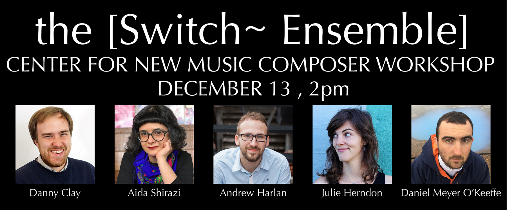

Congratulations to the five composers selected for our Center for New Music Workshop! **Danny Clay**, **Andrew Harlan**, **Julie Herndon**, **Daniel Meyer O'Keeffe**, and **Aida Shirazi**. Their submissions each illustrated both strong imagination and technical ability, and we look forward to collaborating with them soon! Thank you to the many talented composers who submitted! The quality was very high, and ultimately we selected projects that we felt would most benefit from the workshop environment. This event is open to the public, and we encourage other composers to attend!
**Location:** San Francisco Center for New Music, 55 Taylor Street, San Francisco, CA 94102.
**Time:** 2pm, December 13th.

**Danny Clay** is a composer based in San Francisco. His work is deeply rooted in collaboration, building new works with curious minds from many different backgrounds and levels of artistic experience. Recent projects have involved Kronos Quartet, Eighth Blackbird, Third Coast Percussion, pianist Sarah Cahill, and his elementary school music students at Zion Lutheran School in SF. https://www.dclaymusic.com/

**Andrew Harlan** is a composer and bassist based in Berkeley, California. His work has been featured in festivals such as the Yellow Barn Young Artists Program, Valencia International Performance Academy, Summer Institute of Contemporary Performance Practice, and the Wellesley Composers Conference. He has previously collaborated with Erik Drescher, The Boston Conservatory Contemporary Music Ensemble, Felicia Chen and Olivia Harris, Sound Icon, The Boston Musica Viva, and Wet Ink Ensemble. He received first prize in the 2017 loadbang Commissioning Competition, the 2015-2016 Boston Conservatory Sinfonietta Composition Competition, and was selected as a finalist for the 2017 BMI student composer awards. http://music.berkeley.edu/people/andrew-harlan/

**Julie Herndon** is an Oakland-based composer and performer working with internal/external space through song, electronics, text, graphics, and improvisation. Her electroacoustic work has been described as “striking” and “blended to inhabit a surprisingly expressive space” (San Francisco Classical Voice). Her compositions and have been performed by ensembles including Line Upon Line Percussion, Retro Disco, Elevate Ensemble, Left Coast Chamber Ensemble, and St. Lawrence String Quartet, and included at festivals and venues such as Artistry Space and hotel vagabond in Singapore, soundSCAPE in Italy, Zen Mountain Cloud Center in Santa Fe, Wintergreen Performing Arts Summer Festival in Virginia, Megapolis Audio Art Festival in Oakland, and Hot Air Festival in San Francisco. As a pianist and vocalist, Julie is an active performer and collaborator with H/I Ensemble. She is currently the composer in residence for Voci Women’s Vocal Ensemble and is a doctoral candidate at Stanford University. http://www.julieherndonmusic.com/

**Daniel Meyer-O'Keeffe** is a composer and performer based in Joshua Tree, California. His music has been featured at June in Buffalo, the Atlantic Music Festival and performed across the east and west coasts of the United States and Canada. Recent projects include participation in the Crab Bear Lab at the Donaueschinger Musiktage 2017, a commission for a new work by Pronto Musica, a Performance/Installation for solo percussion at the Eastern Bloc Gallery in Montreal, QC, and a tour across California with percussionist Rob Cosgrove. Daniel Received his BA in music composition from Bard College, where he studied with Matt Sargent and Joan Tower. After completing a year of an MM degree at McGill university, he left Montreal for the California desert to work and study (remotely) with Hanna Eimermacher. http://danielmeyerokeeffe.com/

Born and raised in Tehran, Iran, **Aida Shirazi** is a Ph.D. student of composition at the University of California, Davis and works with Pablo Ortiz.  She holds her B.M. in music composition and theory from Bilkent University (Turkey).  Her music is described as “well-made” and “affecting” by The New Yorker. Shirazi is the winner of Diaphonia and XelmYa+, ACIMC and Bilgi New Music Festival calls for scores.  Her music has been featured in MATA, Klasik Keyifler, Sesin Yolculugu, Young Composers, Young Performers festivals in the United States and Europe, and performed by Andrew McIntosh, Lucy Fitz Gibbon, Ryan McCullough, Alexa Renger, Ellen Jewett, Empyrean Ensemble, FOM (The Friends of MATA) and Bilkent Symphony Orchestra. Shirazi’s music is often influenced by literature, language, and Iranian classical music. Shirazi has studied with composers Mika Pelo, Kurt Rohde, Yigit Aydin, Onur Turkmen, Tolga Yayalar, Hooshyar Khayam and Mark Andre. http://aidashirazi.com/

___

## Workshop at San Francisco Center for New Music

**San Francisco Bay Area Composers**: The [Switch~ Ensemble] is happy to announce a call for scores and proposals to participate in a workshop at the San Francisco Center for New Music on December 13th, 2017 at 2pm.

Four to five composers will be selected for their works to be rehearsed, discussed, and read-through with recording. Entry and participation are free of charge, and this event is open to the public.

This workshop is made possible by generous individual donations to our crowdfunding campaign running through December 7th, and ticket sales for our Center for New Music concert December 13th at 8pm featuring works by Fausto Romitelli, Elvira Garifzyanova, Santiago Díez Fischer, Tonia Ko and more TBA. To support the work of emerging composers and our endeavors as an ensemble to fuse technology and performance, consider making a donation at: http://www.switchensemble.com/support

This is an opportunity to work closely with the ensemble, have your existing work or sketches for a new work read and recorded, as well as participate in a discussion with the ensemble and receive feedback from mentor composers and technicians Jason Thorpe Buchanan and Clay Mettens. We hope to receive works that we can consider for performances in the future, as well as to identify composers for future collaboration.

### Instrumentation

- flute/bass flute/piccolo
- clarinet/bass clarinet
- violin
- cello
- piano

Electronics are possible, but given the brief duration of each reading session, composers must be fully prepared to operate their patch without any technical troubleshooting. We will have mics, speakers, cables, and an audio interface at the ready for each participating composer. Any technical requirements beyond this should be outlined in the submission and communicated to the ensemble in advance of the workshop.

### Submission

[Application Form](https://goo.gl/forms/x1N0RmxJm6pGXcKg2)

Rolling from Oct. 27 through Dec. 1. Will review materials upon receipt, 4-5 spaces are available.

**SUBMISSION MATERIALS**

Composers should submit either:

A) an existing work for flute, clarinet, violin, cello, and piano, or any subset. Doublings available. Recording optional.
B) a proposal for a 2-5 minute sketch that can be completed by Dec. 5 (with parts), accompanied by 2 existing portfolio pieces with recordings (if available) Scores should be submitted with links via Dropbox or a similar file sharing service. Recordings can be sent via a streaming service such Soundcloud, YouTube, Vimeo, or an .mp3 file via file sharing.
Submissions do not need to be anonymous.

We encourage you to share the works that best represent your abilities and interests as a composer. The [Switch~ Ensemble]'s mission is to create new works for ensemble and technology, therefore works or proposals for sketches intended to later include electronics or media will be given priority (though acoustic works and sketches without electronics are perfectly acceptable).

**ELIGIBILITY**

The [Switch~ Ensemble] is principally interested in supporting emerging composers, but we understand that "emerging" means something different to everyone—and that emerging composers come at a wide range of ages. Generally, we think of emerging composers as either (1) still enrolled in post-secondary or graduate study, (2) still seeking or only recently-appointed to full-time musical employment, or (3) still on a trajectory of development and self-renewal in musical thinking.

We particularly encourage composers without current institutional opportunities to work with professional ensembles to apply for this workshop, and all ages are welcome. Any submitted works that match our instrumentation or a subset of it are eligible for consideration for our future programming and repertoire. We hope to discover new works that we’ll be excited to perform on our future seasons, and make new contacts with composers for future collaboration.

Please submit scores and recordings (audio or video) with a link via Dropbox or streaming service on our online application form.

​Questions? Please contact jason@switchensemble.com
