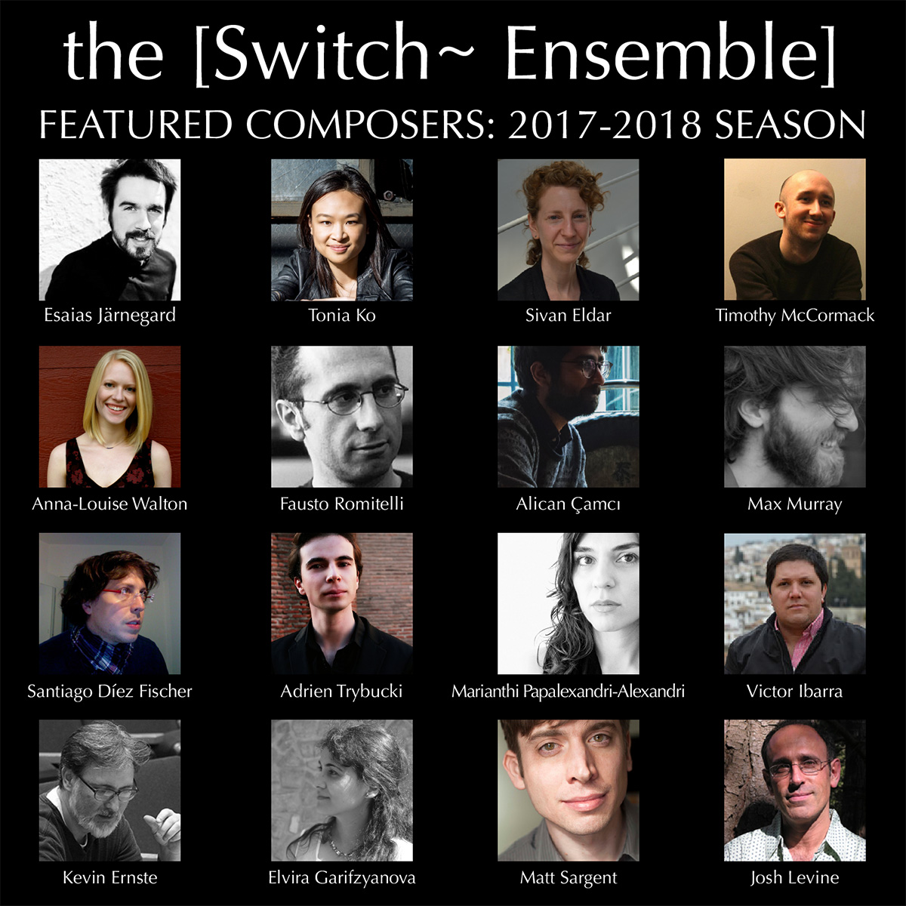

## Crowdfunding Campaign

The [Switch~ Ensemble] seeks support for our 2017-18 season during which we will share our cutting-edge blend of chamber music and electronics or multimedia with performers, composers, and audiences across the United States. Our events include concerts and workshops for community members in San Francisco at the Center for New Music and Berkeley's CNMAT in California; an upstate New York tour where we will be premiering a dozen new works for chamber ensemble and electronics; and a CD release including some of our most exciting repertoire written for or premiered nationally by [Switch~], including Timothy McCormack's *karst survey*, Elvira Garifzyanova's *Aurora Borealis*, Alican Çamci's *landscape with inscription*, and Anna-Louise Walton's *Jökulsárlon*. Our season will culminate in the NYC premiere of two new commissions from Esaias Järnegard and Adrien Trybucki, our 2016-17 International Commissioning Competition Winners, and more exciting new repertoire for ensemble and technology. [Switch~] is committed to supporting the work of emerging composers and each event will highlight different aspects of this mission.

Please consider making a donation to our campaign today.

  <iframe class="embed-responsive-item" width="560" height="315" src="https://www.youtube.com/embed/Sc6gn-AZd3E" frameborder="0" allowfullscreen></iframe>

  <a class="btn btn-lg btn-round btn-primary" href="https://fundraising.fracturedatlas.org/the-switch-ensemble/campaigns/1516" role="button">Donate Now!</a>

### About Our Campaign

  
San Francisco Bay Area Tour: C4NM and CNMAT

  
December 2017

The [Switch~ Ensemble] presents two concerts at the San Francisco Center for New Music (C4NM) and UC Berkeley’s Center for New Music and Audio Technology (CNMAT). We will also read new works and offer consultations to composers as part of a workshop hosted by C4NM. Our repertoire includes Fausto Romitelli's *Domeniche alla periferia dell'impero* for amplified quartet, Tonia Ko's *Tribute \| Axis II* for violin and piano, Santiago Díez Fischer's *Loop's Definition* for solo violin and electronics, Elvira Garifzyanova's *Aurora Borealis* for solo flute and electronics, Sivan Eldar's *Tarr* and more.

  
Upstate New York Tour: [Switch~ Ensemble] Commissions Matt Sargent

  
February-March 2018

Our tour of Upstate New York is a homecoming for [Switch~], which formed at the Eastman School of Music’s Computer Music Center in 2012. The tour will include residencies at Bard College, Ithaca College, Cornell University, and Buffalo State University. In addition to premiering a commissioned work by Matt Sargent, the [Switch~ Ensemble] will also be performing or reading new works by student composers at each of these institutions. We also will be playing works by faculty composers Kevin Ernste, Marianthi Papalexandri-Alexandri, and Roberto Sierra at Cornell University and revisiting 20th century classics by two pioneering experimental composers with ties to the region: Earle Brown and Morton Feldman.

  
New York City Premieres: Commissioning Competition Winners

  
Spring 2018

The [Switch~ Ensemble] premieres two newly-commissioned works by our 2016-17 International Commissioning Competition Winners, Adrien Trybucki and Esaias Järnegard. Adrien and Esaias describe their works in progress:

“My approach to electronic sound influences my instrumental writing and vice versa. This is especially evident in works combining the two, and that is what excites me about writing electroacoustic music. In my new work for the [Switch~ Ensemble], I want to explore both how electronics can prolong instrumental gestures and how the sound of the ensemble can blend into the electronics. I would like to create a universe where the ambiguity between these two worlds is constant, causing the listener to question what comes from the human instrumentalists and what comes from the machine.” - Adrien Trybucki

"The sonic expansion of my palette which the project implies has forced me to revisit my past and propelled me into uncharted waters. In the center stands one of Antonin Artaud's final ‘radio-plays,' *pour finir avec le jugement de dieu*, a haunting, dark exposé. The title on my work desk, *Songs for Antonin*, becomes more and more fixed. These are songs which will take place in the ensemble, in both active and "passive" instruments through acoustic and electronic means, blurring the edges of their distinction." - Esaias Järnegard

100% of the funds raised will go to the musicians, production, and travel-related costs for these performances.

  



<!--
### Help commission an innovative new work!

We have already generated a great deal of momentum as we plan our 2017-18 season! We are excited for collaborations with Swiss composer Katharina Rosenberger, American composer Matt Sargent, and Switch~'s Artistic Director Jason Thorpe Buchanan.

We are raising commissioning fees for the creation of each new work to support the commissioning fee and remaining production expenses. Plans for next season include premieres and residencies in New York, Chicago, San Diego, San Francisco, and Europe.

Many thanks for your support,
Switch~ Ensemble

Jason Thorpe Buchanan, composer (Artistic Director)  
Christopher Chandler, composer (Executive Director)  
Clay Mettens, composer (Director of Development)  
Zach Sheets, flute  
Madison Greenstone, clarinet  
Matt Evans, saxophone  
Lauren Cauley, violin  
T.J. Borden, cello  
Wei-Han Wu, piano  
Megan Arns, percussion
-->
